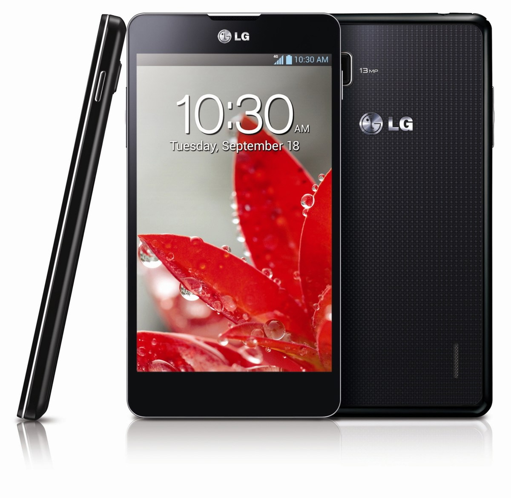
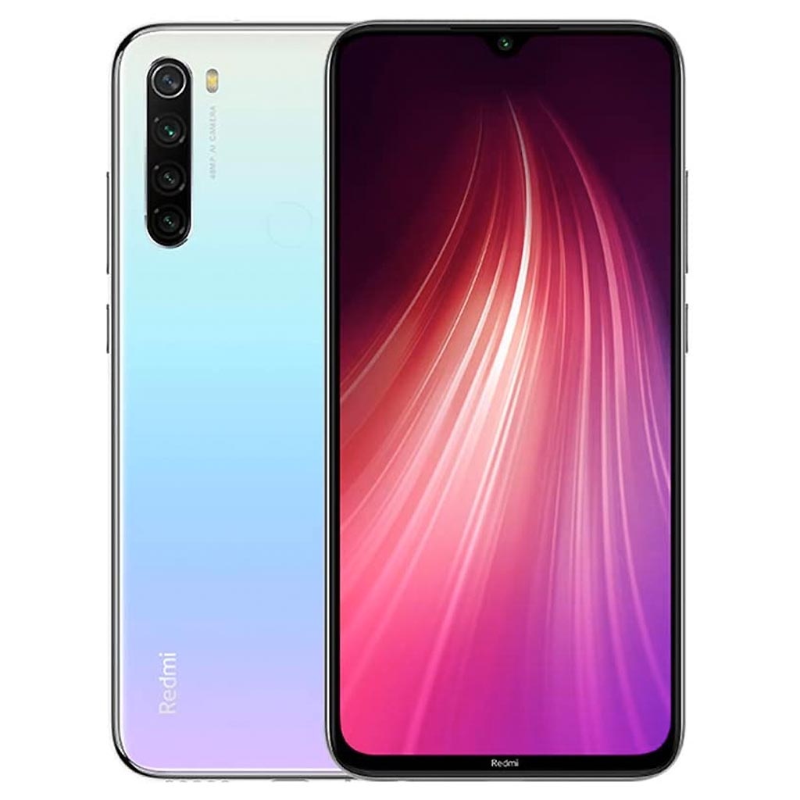
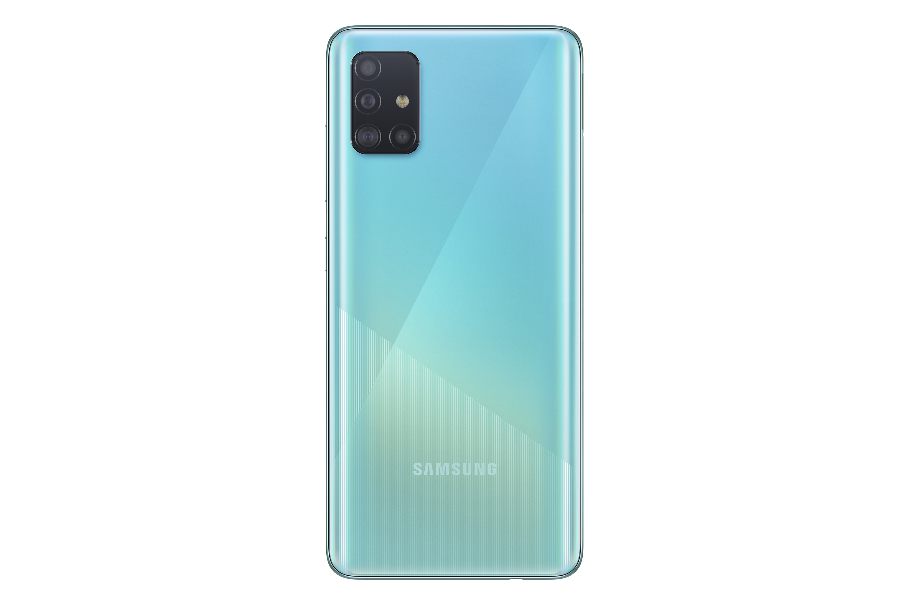
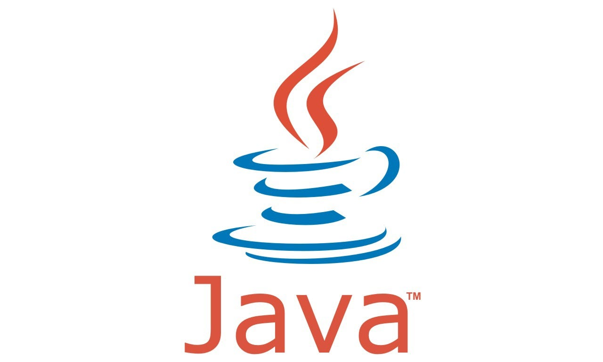
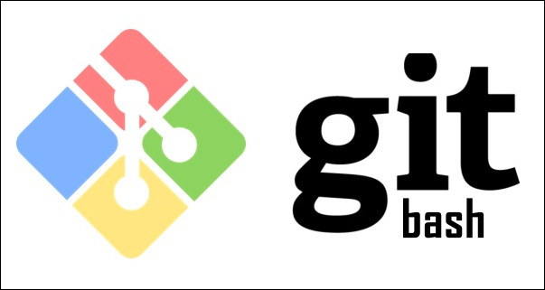
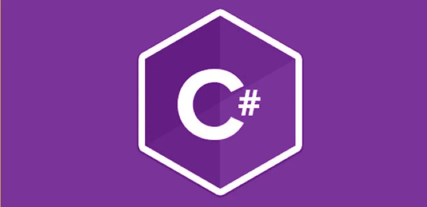

#
# LINEA DEL TIEMPO- 
## MI EXPERIENCIA CON LA TECNOLOGÍA:
###### ( Solo hablo de los dispositivos que de verdad tuvieron algo que ver en mi " desarrollo" con los ordenadores y que he manipulado de forma conscientemente, no incluyo **televisores**, **tablets**, **nintendos**, **plays** ,etc. Porque las he usado y manejado desde pequeña pero no es importante en mi experiencia con la tecnología)

> Tuve mi primera Nintendo Ds con 9 años, más adelante tuve una Nintendo Switch.

> Jugué a la play un poco más tarde que a ver la televisión, ya que ésta la empecé a ver muy pequeña y la Play la empecé a usar, con 7 años la Play 2, y luego la Play 3.

#
# **2010**:
### El primer teléfono que tuve fue cuando era muy pequeña, no le usaba mucho pero fue mi **primer** contacto directo con un dispositivo.
>
#
# **2013/2014**:
### Estos años pasé a un teléfono más "moderno", lo usaba para cosas puntuales y llamadas de emergencia también aprendí junto a mi padre algo del *hardware* del teléfono desmontandolo entero.
> 
#
# **2017 en adelante**:
### A partir del 2017 he ido teniendo teléfonos ya conocidos como *smartphones*, muy actualizados y de apariencia como los vemos hoy en día, también empecé con la asignatura de **Tecnología**, en la que dimos la diferencia entre *Hardware* y *Software* y sus componentes.
#### - Algunos de los móviles que tuve fueron parecidos a estos:

>* 
>* 
#
# **2019**:
### Este año mi instituto colocó como optativa **Informática**. Dimos tanto teoría como práctica y muchas de ellas fueron en *Scratch* donde aprendí con vídeos tutoriales, a primera mano, lo más parecido a programar que había hecho en toda mi vida.

#### Algunos de los juegos que realizamos fueron:
##### 1. **Flappy Bird**.
##### 2. **El de saltar esquivando obstáculos**.
##### 3. **Una nave espacial que destroza meteoritos**.
#
# **2020-2023**:

### Durante todos estos años dejé de tener contacto con los ordenadores, excepto para algunos trabajos, ver la televisión, móvil..., ya que en estos cursos me cambié a *Sociales* y no dí *Tecnología* ni *Informática*.
#
# **2024- en adelante**:

### Tras acabar Bachiller me dí cuenta, estando en sociales, que disfrutaba y me interesaba la **Informática** y lo que sabía de ella.Así que después de la *EBAU* acabé haciendo **Ingenieria Informática**. 
>Está siendo bastante emocionante porque no conocía nada sobre ella. 
#### He aprendido lo que llevo de curso a programar desde *consola* cosas muy básicas, como crear carpetas y archivos. Pero vamos a ir entrando y aprendiendo más sobre otros lenguajes y sus plataformas poco a poco.
>Estas son algunas de las plataformas informáticas y lenguajes que vamos a ver a lo largo de este año.

##### **(Para final de curso espero haber podido aprender mucho y trabajar en algo que de verdad disfrute).**
