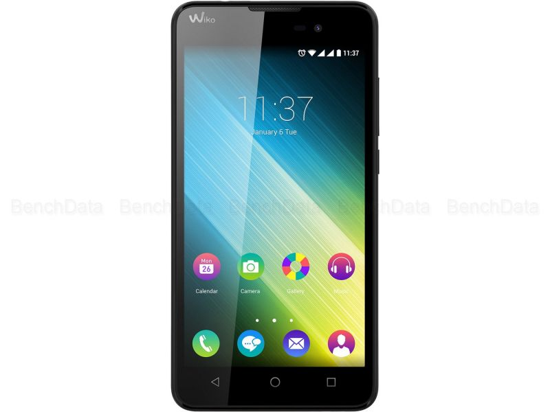
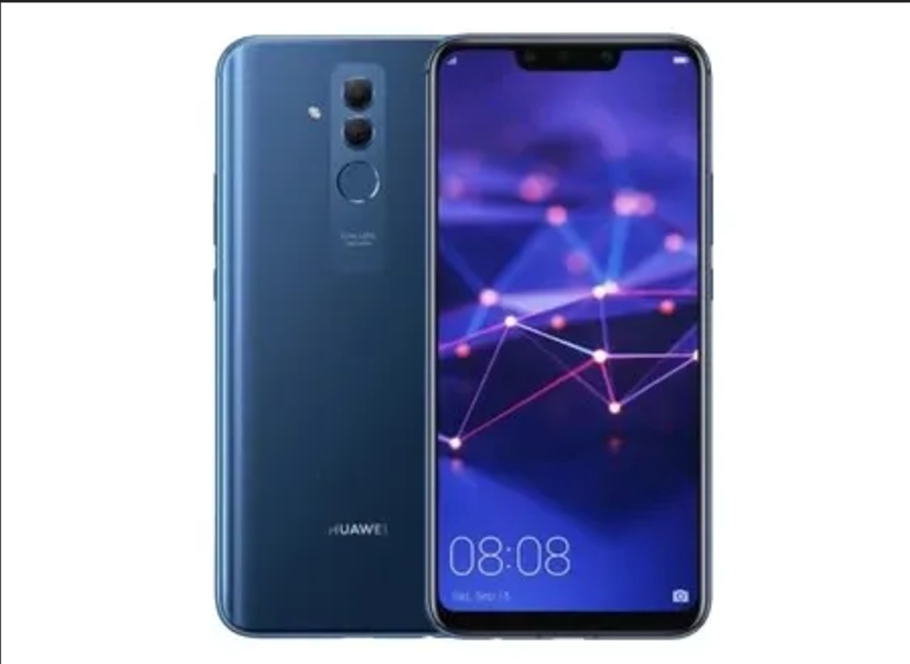

# Línea Temporal Alejandro De La Peña Marcos
> ### Buenas, en esta línea temporal explicaré mi experiencia con toda clase de dispositivos electrónicos a lo largo de mi vida empezando desde una temprana edad.
## 2006 - 2010
- Con 2 años fue la primera vez que utilicé una videoconsola, la [Nintendo DS](/alejandro_delapeña/img/DS.jpg) para jugar Mario Kart.
- A los 4 años utilicé la Nintendo WII por primera vez y tanto mi padre como mi tio me enseñaron **tanto a grabar juegos en CDs como a piratear la consola.**
## 2011 - 2015
- A los 6 años tuvé mi primera consola portatil la [Nintendo 3DS](/alejandro_delapeña/img/3DS.jpg) con la que aprendí a grabar ROMs de videojuegos de la [Nintendo DS](/alejandro_delapeña/img/DS.jpg) en una **micro sd** que iría después en una [***Tarjeta R4***](https://www.youtube.com/watch?v=_T4fB_qypUg).
- A los 7 años usé por primera vez el pc de mi padre con una **GPU *Radeon R7 270***, una **CPU *i3 serie 4000***, **RAM *8 GB.***
- A los 8 años tuvé una [PSVITA](/alejandro_delapeña/img/PSVITA.jpg). Además participé en un curso de robótica en el cual usamos un **software de bloques** para programarlos, creando dos robots:
   - ***Carreras***
   - ***Sumo***
## 2016 - 2020
- En mi 10.º cumpleaños me regalaron la [PS4](/alejandro_delapeña/img/PS4.jpg) en su momento la consola revolucionaria con nuevas tecnologías y similar a un pc y la cual desmonte para revisar sus componentes internos y arreglar su disquetera. Mis primeros shooters fueron el [*Battlefield 4*](/alejandro_delapeña/img/BF4.jpg) y [*Black ops 3*](/alejandro_delapeña/img/COD.jpg).
- A los 11 años tuvé mi primer pc personal con una **GPU *Radeon RX 470***, **CPU *Ryzen 3 1200***, **RAM *16 GB.***
- A los 12 años participe en un curso de programación básico para **mods** y **plugins** de [*Minecraft*](/alejandro_delapeña/img/MINE.jpg) usando el lenguaje de **JavaScript.**
- A los 13 años me reglaron mi primer movil un **Wiko 2** que me sirvio durante menos de 1 año debido a su mal rendimiento. Luego al año siguiente me cambié de movil a un **Huaweii Mate 20 Lite**, *suponiendo un gran cambio en rendimiento a lo que respecta del anterior.*
>#  
>#  
## 2021 - 2024
- A los 15 años utilicé por primera vez el Scratch **(lamentáblemente no me acuerdo del usuario que utilizaba entonces)** para realizar los siguientes juegos:
   - ***Pong***
   - ***Racing***
   - ***Platforms***
- A los 16 años me compre un movil nuevo **"Poco F4"** mi actual movil. También tuvé la [Nintendo Switch](/alejandro_delapeña/img/SWITCH.jpg) para poder disfrutar del [*Pokemon Escarlata*](/alejandro_delapeña/img/POKE.jpg).
>#  
- A los 17 años decidí mejorar los componentes de mi ordenador con una **GPU *Radeon RX 6700 XT***, **CPU *Ryzen 7 5800X3D***, **RAM *32 GB.***
- Actualmente he empezado a investigar más a fondo sobre **dispositivos y tecnologías** más actuales ya que me interesa mucho ***la seguridad digital y los métodos que los "Hackers" usan para virlar la seguridad de los programas de blockeo de las empresas.*** Además, monté el pc que utilizó actualmente viendo la estructura interna a parte de empezar a solucionar ciertos problemas que tuve en BIOS. 
