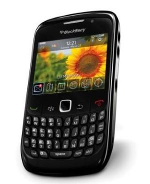

###### | Andrea Anaya Laureano |
>## *Time line*
# 	 Mi primer contacto con la informática (2009)
Uno de los primeros años donde los *nokias* eran los dispositivos más comunes del mercado, me dieron uno, fue mi primer móvil. Lo usaba para grabar videos y hacer muchas fotos, llamadas y jugar a los típicos juegos que habian como **Snake III**,  **RedBall** o el mismo **tetris**. Estuve muy familiarizada con las tecnologías desde muy temprana edad.

  
# Primeros móviles (2009-2011)
Fui cambiando cada muy poco de dispositivos, no recuerdo muy bien los modelos, pero entre ellos 100% había una **blackberry** y bastantes modelos de **nokias**.                  

 

# Primera consola (2012)
  Hablando de minijuegos del dispositivo móvil, comencé a interesarme por los videojuegos, comencé con una consola que estaba muy de moda por aquel entonces, la PlayStation 3, aunque no tenía mucha idea y prefería la diversidad de la Wii. Estas fueron mis primeras consolas. Entre ellas la que más solía utilizar era la Wii, para jugar al Mario Kart o al Wii party, Just dance, etc.

# Dispositivos más modernos (2013)
Mi primer dispositivo táctil fue una tablet de la marca Samsung, el modélo era un *Galaxy Tab S* NEGRA. Durante este año descubrí un nuevo mundo a través de esta tablet, comencé a interesarme por los videojuegos y la comunidad de youtubers que estaban por comenzar sus carreras. La utilizaba solo para el ocio en momentos libres.

 

> [!IMPORTANT]
> Durante esta misma etapa, me fijé que había un PC de sobremesa en casa pero no sabía usarlo porque era muy voluminoso, lento y a mi parecer raro. Resulta que era uno de los **pcs antiguos**  1 que quedaban con el monitor ancho, parecía una televisión pequeña antigua.

# Peak de mi etapa en la tecnología (2014-2020)
Aparte del **pc de sobremesa** 1 que había por casa, un día me compraron un portátil bastante potente de la marca lenovo, con un i5, lo usaba sin ratón, fue aquí donde descubrí que los videojuegos que había visto a través de una pantalla no se me daban tan mal, y además con el Touchpad. 

Comencé con el _minecraft_, y como estaba a mi alcance, sin tener ni idea de lo que hacía creé varios _paquetes de texturas_, _personalicé muchas skins_, y **creé un pequeño mod** con cosas que vi por internet, a día de hoy creo que fue mi primera interacción con el **java**. 
Con este videojuego me di cuenta que me gustaba ganar más que pasarmelo bien, solo jugaba a cosas que fueran 1v1 para demostrar cosas, ya que como dije antes, además jugaba con el TouchPad, agregandole un poco de dificultad. 

*Aquí entra una objeción que a través de los años ha sido un problema cada vez más visible en la comunidad de los videojuegos.*

> [!NOTE]
> Una pequeña anotación mía, es que a través de los años me he dado cuenta de una gran injusticia, los videojuegos se han estado dividiendo entre juegos para chicas o chicos. Siempre escuché comentarios del género opuesto confirmandolo (y hasta de mi propio género), dividiendolo todo dentro de los videojuegos, "roles de chica", "personajes de chicas", etc. 
> 
Me tomé mucho mas enserio lo que me gustaba, que era ganar e intentar hacer ver que los videojuegos no tenían género y que a todo el mundo se lo podía dar bien. Descubrí uno de los más grandes videojuegos que la industria del competitivo tiene, el [League of Legends](https://www.leagueoflegends.com/es-es/news/riot-games/). Me metí en equipos amateur ya que tenía el "nivel", competí en ello por una temporada negandome a utilizar lo que antes comentaba "personajes de chica", además que tenía facilidad por ser joven, o como llamaban "young promise" y alcancé mi meta principal ahí, sin embargo como la sociedad no avanza y el hecho de ser de un género u otro influye mucho, acabé dejándolo.

No obstante, descubrí una variedad de juegos que me llamaron mucho la atención y les dediqué muchas horas, aquí una lista de los más conocidos durante estos años que he jugado y alguno nuevo que me gustaría probar:

- [x] Minecraft
- [x] Valorant
- [x] CSGO
- [x] COD warzone
- [x] League of legends
- [x] Terraria
- [x] PUBG
- [ ] Elden ring
- [ ] Overwatch

# Móviles nuevos y último PC (Actualidad)
Cada aproximadamente dos años hasta hace 3, iba cambiando el móvil, todos de samsung, hasta el que tengo actualmente, el s20 FE 5G. Todos táctiles y eran los que salían el mismo año, s9, s10, s11+, etc. 

Estudié por mi cuenta un poco de httml y el como abrir maquinas virtuales para hacer algun trabajillo aunque no me llamó mucho la atención.

Mantuve el portatil que tenía por bastantes años, fue un poco frustrante ya que se volvió bastante lento y la batería no duraba mucho. Sin embargo este año me dieron un presupuesto para comprar un PC nuevo y lo monté con estas piezas:
* Una GEFORCE RTX 3070 ti
* Un procesador  i5-10600K
* Rams de 32 GB de Tforce
* Refrigeración líquida
* Placa base Asus ROG Strix B550-A Gaming
* etc..

Creo que es un PC que se adapta muy bien a lo que quería, y para ser el primero que monto va muy bien, además la estética se queda cerca de como quería que fuera el set up entero, un all-white.
 
>##### Y hasta a día de hoy este ha sido mi timeline relacionado con la informática. Gracias
