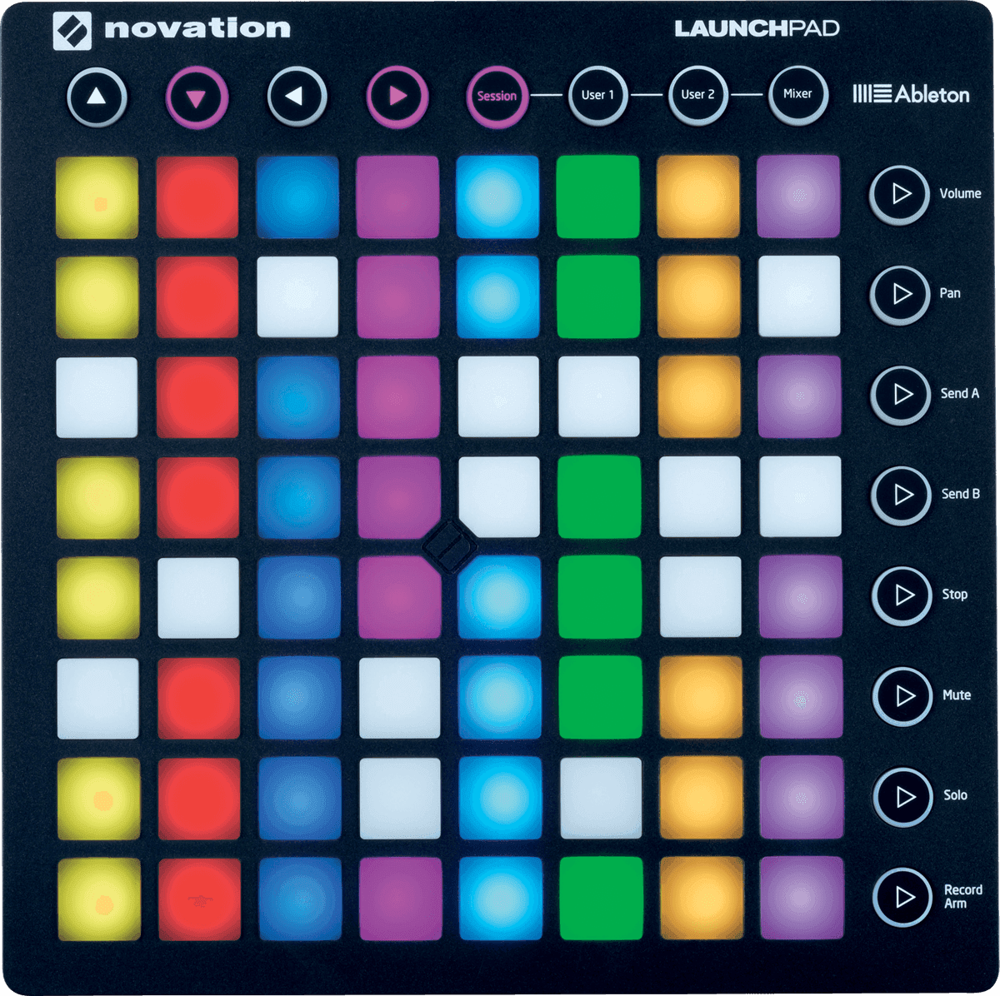
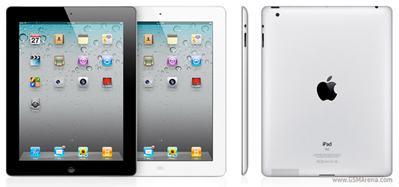
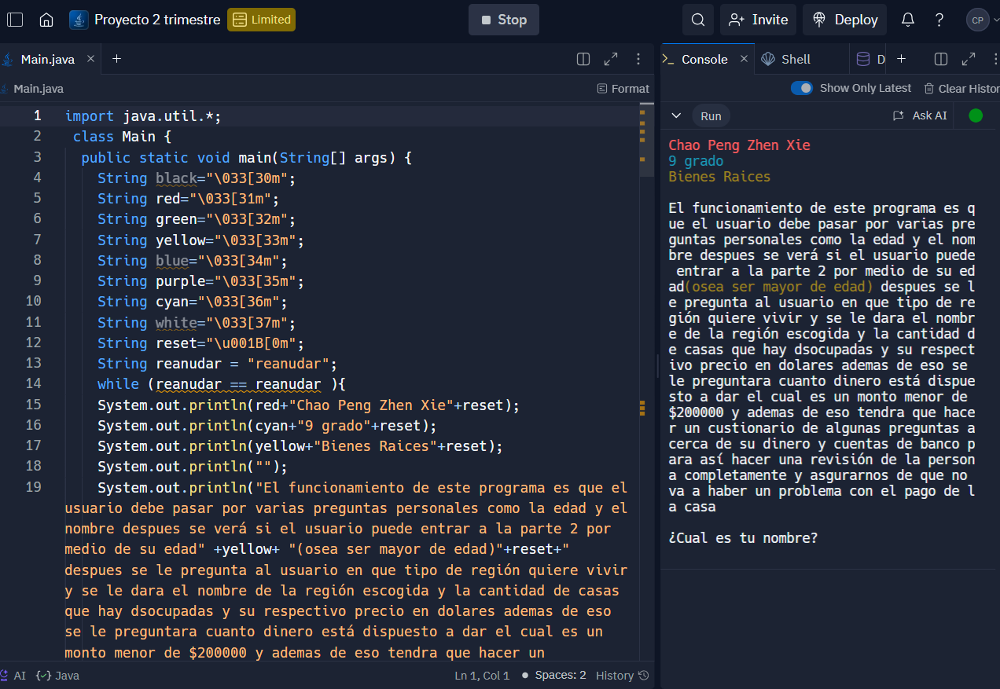

# **La Evolución de la Informática Através de mi Vida**

## **/ Chao Peng Zhen Xie /**

- 
La tecnología através de mi vida ha sido muy inflyente ya que nací al principio de un auge tecnológico el cual fue creciendo exponencialmente hasta el dia de hoy.

---
### **(2011) - El Primer Encuentro con la Tecnología** 

- Fui a China a visitar a mi familia, en ese tiempo China iba muy avanzada tecnológicamente a lo que era y es Costa Rica por lo que me dio curiosidad una maquina con la que estaba trabajando un tío mío y resultó siendo una computadora con la que me metí de lleno a jugar con ella y a analizarla completamente. 
 
 
>***EL primer pc con el que interaccioné.***

### **(2012-2013) - Sigue el Interes por las Computadoras y mi Primer Contacto con un Iphone** 

- Después de mi aventura por China y sus increibles avances tecnológicos, la curiosidad en mí despertó y empezó a interesarse por las computadoras aún más. Mi primo en ese tiempo también era un fanático de las computadoras, por lo que el se compró una en aquel tiempo y yo me sentadaba atrás de él para verlo jugar videojuegos y ver peliculas también, inclusive, él me dejaba jugar algunos de sus juegos para que yo me entretuviera. 

    
> ***Uno de los primeros juegos que jugué en pc.***
 
- En Costa Rica en aquellos años estaba surgiendo una nueva tendencia, [El Iphone 5](https://support.apple.com/es-es/112016), ya que era un smartphone muy novedoso y muy lindo a la vista, tanto fue así que mi papá decidió comprarse uno y fue uno de los primeros teléfonos con los que me meti de lleno a juguetear con él y saber cada funcionalidad de su sistema. 
 
 
> ***El Iphone 5***

### **(2015) - Mi Primer Ipad** 

- Apple estaba creciendo exponencialmente en esos tiempos y todo el mundo quería un producto de Apple, ya que este lo vendian como un producto futurista y muy lindo a la vista, por lo que en un viaje a Estados Unidos fuimos a una Apple Store y mis padres me compraron mi primer Ipad , dicho aparato me encantó y enamoró con el sistema IOS, todas sus funcionalidades y la calidad del producto eran cosas que deslumbraban e inclusive hacía que tuviera más curiosidad sobre el como se llegaba a formar un aparato tan mágico. 
 
 
> ***[El Ipad 2](https://support.apple.com/es-es/111990)***

### **(2018) - Mi Primer Teléfono** 

- EN 2018 decidí comprarme mi primer teléfono, el cual fue un [Huawei P20 Lite](https://www.xatakandroid.com/moviles-android/huawei-p20-lite-caracteristicas-precio-y-ficha-tecnica) , para aquel tiempo era un buen teléfono ya que tenía mucha tecnología, el escaneo de huellas digitales, la cámara era buena y me redía muy bien para lo que era mis nesecidades de aquel tiempo. 
 
 

> ***Huawei P20 Lite***

### **(2019) - Mi Primer Computadora Portátil** 

- En 2019 cuando estaba en el colegio por temas de trabajos y presentaciones me tuve que comprar un potátil que pudiera rendir de manera optima a mis  necesidades por lo que me compré una [PORTATIL HP 15-DA0016NS ](https://support.hp.com/es-es/document/c06053960), un portátil muy normal, no muy extraordinario sin embargo cubría la nescesidades del momento y que pasó pandemia conmigo.  
 
 

> *** La Poderosa PORTATIL HP 15-DA0016NS ***

### **(2020) - Mi Primer Lenguaje de Programación** 

- En 2020 implementaron una nueva materia al colegio donde yo estudiaba, dicha materia era Programación, una cosa que yo en mi vida había escuchado y solo pensaba que los hackers podían hacer, sin embargo fue todo lo contrario, conforme iban pasasndo las clases mis habilidades iban escalando y eso me gutaba, además del hecho que se podian hacer cosas muy interesantes con dicho lenguaje.  
 
 

> ***[Este es un trabajo en Replit que lo tuve que hacer en Java era sobre bienes raices](https://replit.com/join/kfywyfzckw-chaopengpeng)***

