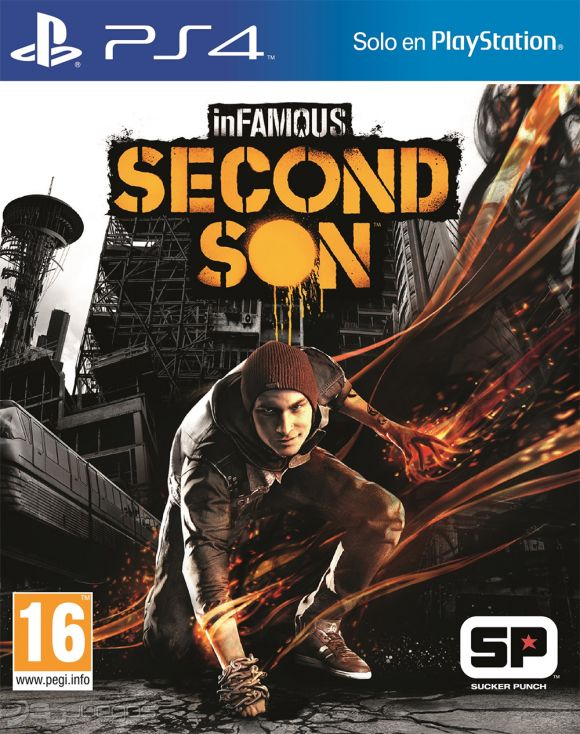
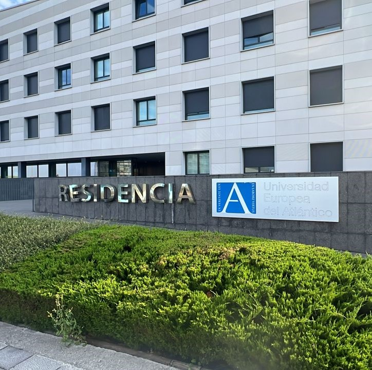

  <strong>Hola</strong>

***Esta tarea se entrega a mas tardar el domingo, pero prefiero hacerla ahora***

# Este soy yo 
  Mi nombre es _Diego Perozo_ y naci el 22 de Septiembre del 2007. Me gustan muchas cosas la verdad que a veces me es complicado poder hablar sobre una cosa en concreto asi que intentare organizarme de mejor manera para hablar solo de cosas interesantes y mi acercamiento a lo que es la tecnologia y como me interese  por programar.

# Mi primer ordenador

Mi primera compu sinceramente no me acuerdo mucho pero lo maximo es que me acuerdo que la usaba solamente para ver videos de youtube y jugar a los jueguitos que me encontraba por google, luego en mi segundo año como por el asunto del coronavirus todo empezo a ser digital y exactamente esa resulto ser la compu que yo utilizaria todo ese año y poco despues hasta que dejo de funcionar y fue su ultimo momento de vida, entonces quedo en el cuarto de mi hermano acumulando polvo. Pero fue hasta el cumpleaños del 2023 que mi madre luego de usar su laptop por mas o menos 2 años, por fin logro conseguirme la mia y ahora vivo tranquilamente con esa misma laptop que recientemente cumplio 1 año conmigo.

# Mi primera consola y Viedeojuego 

  Mi primera consola como tal fue una Wii, pero la consola que siempre voy a querer en el fondo de mi corazon no importa que se diga, que pase o algo, es mi amada ***PlayStation 3***. Hasta que tuve mas o menos 9 o 10 años que comence a jugar bien con mi play 3, el juego que me llevo a querer muchisimos las historias que pueden llegar a ofreser es ***inFAMOUS 2***.

  

  inFamous 2 es un videojuego de acción y aventura desarrollado por Sucker Punch Productions. Lanzado en junio de 2011, es la secuela de inFamous.

## Sinopsis

En **inFamous 2**, Cole MacGrath el protagonista se enfrenta a una nueva amenaza en la ciudad de New Marais, inspirado en Nueva Orleans. Después de los eventos del primer juego, Cole debe obtener poderes aún más grandes para combatir a **La Bestia**.

### Características Principales

- **Mundo Abierto**
- **Poderes Eléctricos**
- **Elecciones Morales**

## Mi amor por este juego 

Mi amor por ese juego fue especialmente porque en esos tiempos yo simplemente no tenia muchos juegos para la ps3 y al momento de yo querer jugar o hacer algo ese era mi medio para lograr divertirme mas que jugar el **inFamous 2** eran los minijuegos del minecraft en ese momento con un amigo argentino que al final termino desapareciendo al tiempo, y lo unico que me quedaba era jugar a ese juego.

 Recuerdo las noches en las que quedaba solo dando vueltas y haciendo misiones secundarias porque era lo unico que medio me llamaba la atencion hacer y embobarme con la historia que me resultaba mas que entretenida, al punto de pasarmelo con ambos karmas, tanto el "Bueno" como el "Malo", ademas de que el primer juego que yo probe al momento de que me comrparan mi ps4, fue el "inFamous Second Son" que aunque no fuera secuela directa, si es otro juego de la saga. ¿Volveria a jugar inFamous 2? Si, y tengo pensado hacerlo.

 
  
 # Mi primer telefono y mis intereses por la tecnologia

**Mi primer telefono** Sinceramente no me acuerdo mucho pero me acuerdo unod de la marca **Blue** y que no era muy bueno, lo maximo que podia hacer mas que todo era escuchar musica y tomar fotos, al final y al cabo era muy pequeño y igualmente no lo iba a usar por mucho, pero me recuerdo como fue mi evolucion poco a poco entre mis telefonos.

1. ***Samsung J2 Prime***: Mi primer telefono que recuerdo bien fue este y sinceramente no me duro mucho porque me lo dieron y a los pocos meses mi padre me dio mi proximo telefono porque era de el pero se lo cambio porque no le gustaba.

2. ***Iphone 4***: Ese telefono me duro aproximadamente unos 9 meses hasta que en navidad me dieron uno mejor porque a mi en ese momento este telefono no me daba para basicamente nada.

3. ***Iphone 6***: En este mmomento no me importaba mucho el tipo de telefono que tenia pero fue en este telefono que apartir de aqui comence a interesarme mas por la informatica o por los dispositivimos electronicos como las pc gamers.

4. ***Motorola (No se que)***: No me duro ni un mes pero queria salir de los IPhone.

5.  ***Samsung J6***: Luego de mi corta pero medio rara experiencia con los telefonos iphone y mi vuelta corta a los telefonos android, me quise quedar bien.

6. ***Samsung A80***: Aqui fue cuando di un salto radicalmente algo en los telefonos, aunque este telefono me duro extremadamente poco, lo tome porque se me hacia curioso la posibilidad de que la camara fuera la de la parte de atras y que se diera vuelta al momento de querer usar la otra camara.

7. ***Samsung S21***: Este telefono facilmente creo que me duro 1 año y poco mas hasta que por error lo termine metiendo al agua y lamentablemente termino muriendo momentaneamente porque un dia simplemente volvio a funcionar por la cara.

8. ***Tecno Pova 3***: El ultimo telefono que tuve antes de cambiar por el que tengo ahora mismo en la actualidad, facilmente este es el telefono que mas me ha duraro en mi vida y que a pesar de todo supo resistir como un campeon por literalmente mas de 2 años y al final luego de que mi madre ganara una rifa de un IPhone 15 fue que por fin pude cambiarlo.

9. ***IPhone 15***: Ya definitivamente este es mi telefono actual y el que seguramente y pienso que me va a durar muchisimo mas de 1 o 2 años diria yo, no tengo pensado cambiarlo recientemente o dentro de un tiempo porque es relativamente mucho mas nuevo.

# Mi primera interaccion con la programacion

 Mi primera interaccion con la programacion no fue exactamente como varias personas creo que podrian llegar a pensar como el tipico: 
  
    print("¡Hola, Mundo!")"

Yo tuve mi primer acercamiento a la programacion por un pequeño grupo de programacion que hubo en mi liceo durante comienzos de mi cuarto año, comenzaba viendo cosas basicas con HTML y CSS, sinceramente las cosas que podia hacer mientras aprendia ese año eran extremadamente basicas pero me mantenia para lo que me daba mi imaginacion para las paginas y cosas que quisiera hacer. Fue luego al tiempo que intentamos ver JavaScript pero nunca se concreto nada entonces no lo pude ver ni siquiera por encima.

# Mi introduccion mas profunda a la programacion

Fue al momento de meterme en un curso online de una pagina que sinceramente no me acuerdo el nombre pero reconozco que me ayudo muchisimo a reforzar mis conocimientos en HTML, CSS, Git y tambien di mis primeros conocimientos a JavaScript pero por temas personales tuve que dejarlo practicamente sin llegar casi a la mitad pero al menos yo considerando mi conocimiento en Front-end lo tengo muy estable para mi gusto.

# Conclusiones.

Mi interés por la tecnología y la programación ha crecido a lo largo de los años, comenzando con mi amor por los videojuegos y las consolas, en especial mi experiencia con *inFamous 2* y la PlayStation 3. Mi evolución tecnológica también se reflejó en los distintos teléfonos que tuve, cada uno acompañando mi curiosidad y aprendizaje. Mi primer contacto con la programación ocurrió en el liceo, donde aprendí HTML y CSS, y luego me adentré más en este mundo a través de cursos en línea. Aunque no pude completarlos, he logrado establecer una base sólida en el desarrollo *front-end*. Ahora mismo quiero darle el maximo esfuerzo en cuanto a aprender sobre esto que me ha llamado la atencion desde hace muchisimo tiempo y por algo quise aplicar a la beca en esta universidad, para llevar mis conocimientos al maximo y convertirme en un profesional en esto que llevo queriendo conocer desde hace rato.

|Mi primer acercamiento|Evolucion|
|-|-|
  |

