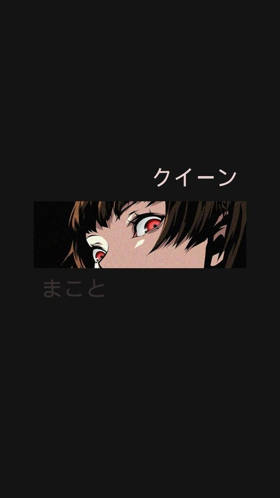
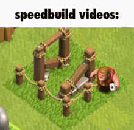
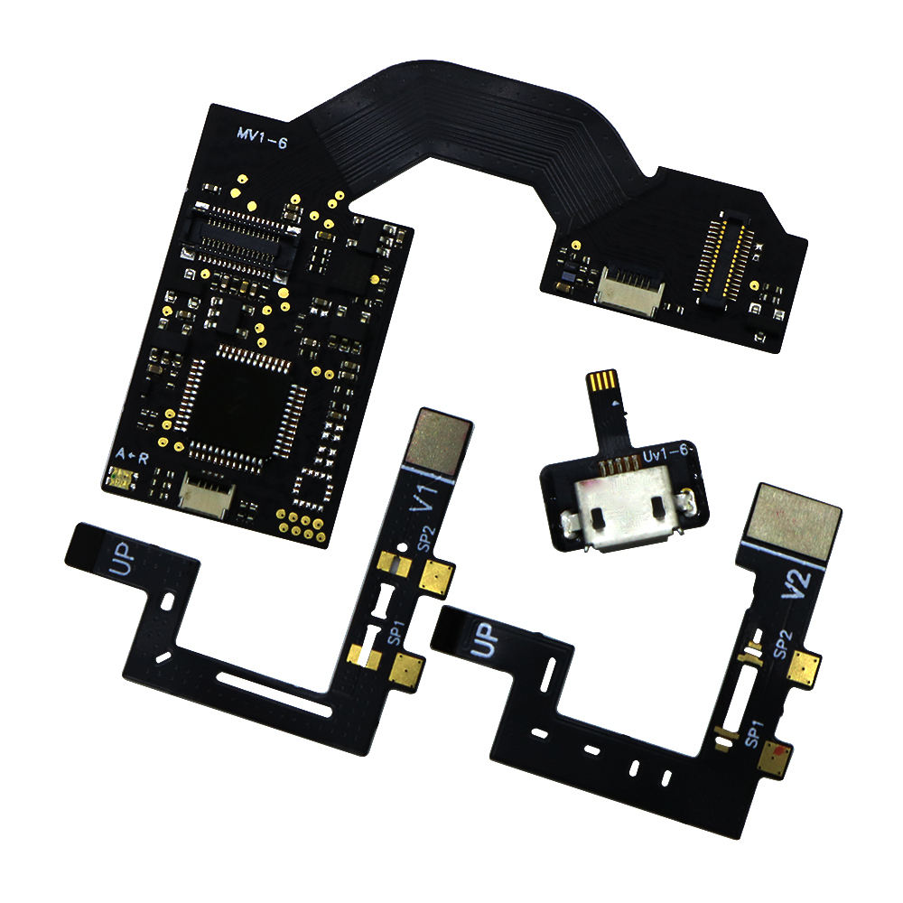

<style>

@import url('https://fonts.googleapis.com/css2?family=PT+Mono&display=swap');

h2 {
        font-family: "PT Mono", monospace;
        text-align: center;
        color: #ff69b4;
        font-size: 4vh;
    }

a {
    color: #F0A8D0;
}

a:hover {
        color: #FFC6C6;
    }

color {
    color: #fad201;
}

hidden {
    display: none;
}

html {
    background: rgba(22, 22, 23, .8);
    color: rgb(245, 245, 247);
}

.container-img-girl img {
    height: max(20vh);
}

.containter-img-eyes{
    height: 15vh;
    width: 100%;
    overflow: hidden;
    display: flex;
    align-items: center;
    place-content: center;
}

   
.containter-img-eyes img {
    aspect-ratio: auto;
    width: 100%;
}

</style>

# ¡Encantado! 👋

## 📒 Índice

<div style="display: flex;">
  <div class="container-img-girl">

  

  </div>
  <div>
  
1. [¿Quién soy?](#-quién-soy)
2. [¿Cuál es mi trayectoria?](#️-cuál-es-mi-trayectoria)
   - Hitos Remarcables
3. [Proyectos Hechos](#-proyectos-hechos)
   - [Intenté hacer un juego idle clicker](#intenté-hacer-un-juego-idle-clicker)
   - [Alteré la configuración de una `nintendo switch` versión 2](#alteré-la-configuración-de-una-nintendo-switch-versión-2)
   - [Página web para un streamer (fan Art)](#página-web-para-un-streamer-fan-art)
4. [Proyectos abiertos](#-proyectos-abiertos)
    
    ...

  </div>
</div>

## ❓ ¿Quién soy?

Legalmente me llamo Javier Liaño, aunque me conocen como "Midas". Actualmente estoy estudiando **Ingeniería Informatica** en la [Universidad Europea del Atlantico][UNEA].

Desde que empecé con la tecnología siempre he tenido en mente la siguiente cita:
> One day, my father, he told me: "Son, don't let it slip away.". — Tim Bergling
<br> *Un día, mi padre me dijo: "Hijo, no dejes que se te escapen las oportunidades"* — Tim Bergling

Me quedé con esta frase y la llevo acabo siempre: <color>***Aprovecha siempre las oportunidades que te da la vida.***</color>

## 🛩️ ¿Cuál es mi trayectoria?

| Año | Explicación |
|:-:|:-|
| **2024...** | Me voy a dedicar a aprobar la universidad. |
| 2023 | He trabajado en una [página](https://github.com/SoyMidas/web-rickyedit) para un youtuber —Fan Art—, lo reaccionó en directo y a pesar de que no lo utilizó, si que dio su visto bueno con la idea. Además también trabaje en otros proyectos tanto de programación como externos a esta rama. Además empiezo a investigar de forma autodidacta el uso de bash, linux, la instalación de distros de linux, el uso de Docker y la aplicación del mismo e instalo en mi ordenador un double boot con archlinux -*reconocida como una de las distros de linux más difíciles de instalar*-. Además tuve Ubuntu, donde diseñé el codigo que se ve en el apartado [señalado abajo](#-codigo-de-ubuntu) y el cuál subí como funcionaba a redes sociales llegando a tener casi **un millón** de visitas y más de **sesenta mil** likes. |
|2021|Empiezo a trabajar en un curso online ([FreeCodeCamp](https://www.freecodecamp.org/)) y meterme en el mundo de HTML, CSS, JavaScript, TypeScript, Tailwind CSS, React y Astro —en orden cronológico—.|
|2020|Debido a la pandemia empiezo a investigar temas relacionados con las ramas de la tecnología informatica.|
|**...2019**| A pesar de que en 2020 empezase a investigar la programación, desde pequeño he tenido varios [hitos remarcables](#-hitos-de-mi-infancia) |

### 💻 Codigo de Ubuntu

```bash
    #!/bin/bash

# ROOT

bienvenida="Buenos días Midas, son las $(date +%I:%M), encantado de volver a verte. ¿Qué es lo que quieres hacer hoy?"
espeak="espeak -v mb/mb-es1 -s150"


# Comandos
if rfkill list bluetooth | grep -q "Soft blocked: yes"; then
    # echo "Bluetooth está deshabilitado. Habilitando Bluetooth..."
    rfkill unblock bluetooth
    sleep 3 # Pausa de 3 segundos
fi

# echo "Conectando al dispositivo Bluetooth con ID: 00:F6:20:E7:B0:88..."
sleep 3
bluetoothctl connect 00:F6:20:E7:B0:88
nohup keepassxc &
sleep 2 

# Comando para hablar
$espeak "$bienvenida"

# Función para crear ventana pop up
function popup {
    zenity --forms --title="$1" --text="Elige una opción:" --add-combo="Opciones" --combo-values="Youtube|Programación|IA"
}

# Crear ventana pop up con 3 botones
function popup {
    respuesta=$(zenity --forms --title="$1" --text="Elige una opción:" --add-combo="Opciones" --combo-values="Youtube|Programación|IA")

    if [[ "$respuesta" == "Youtube" ]]; then
        $espeak "Has elegido la opción Youtube"
    elif [[ "$respuesta" == "Programación" ]]; then
        $espeak "Así que vamos a programar... vale, abriré todo lo necesario"
        
        nohup code &
	    nohup vivaldi https://chat.openai.com/chat &

    elif [[ "$respuesta" == "IA" ]]; then
        $espeak "Has elegido la opción IA"
    else
        $espeak "Has cancelado la operación"
    fi
}

popup "Elige entre las opciones"
sleep 5
```

### 🍭 Hitos de mi infancia

|Hito|Información|
|:-|:-|
|Construí mi ordenador|De pequeño, con ayuda de mi padre compuse un ordenador comprado por partes, actualmente es el que utilizo y estoy muy orgulloso de él.|
| Fuí a clases de programación de pequeño| A los 8-9 años mis padres me apuntaron a unas clases de programación en Scratch y Arduino, además de clases de creación de mods y mapas en Minecraft.|
| Trabajé en un servidor de discord *(no remunerado)*| Entre otras cosas aprendí a utilizar markdown y APIs (como la de discord)|

<div class="containter-img-eyes">



</div>

## 🔒 Proyectos Hechos

### Intenté hacer un juego idle clicker

Trabajé en un proyecto personal que buscaba crear un juego basado en otro de móvil. Mi principal proposito era aprender a utilizar JavaScript y React. [REPOSITORIO](https://github.com/SoyMidas/Millonarie-Game-Dupe-2.0)

<center>



</center>

### Alteré la configuración de una `nintendo switch` versión 2

Instalé un chip parecido a este. Va soldado a la placa y es del tamaño de 2-3 dedos.



### Página web para un streamer (fan Art)

Como ya he puesto en la línea principal, hice una página web para un streamer, la cuál reaccionó y proyecto ideas de mi proyecto en su proximo proyecto de página web. Era un concepto. [REPOSITORIO](https://github.com/SoyMidas/web-rickyedit)

## 🔓 Proyectos abiertos

### [Canal de youtube][CANAL] gestionado, grabado y editado por mi persona

Me gusta **aportar** publicamente con mis conocimientos y con mis experiencias de vida a través de las redes sociales, por esta razón empecé mi canal de youtube y a ser activo en redes sociales. Actualmente me preocupo al completo del canal. Esto me ha enseñado muchas cosas sobre los ordenadores:

- **Manejabilidad** de archivos.
- Correcta **nomenclatura**.
- **Metodos** para ordenar documentos.
- Visión a **futuro**.

<div style="text-align: center;">

[](https://www.youtube.com/watch?v=RyLCSwI6ZJU)

</div>

## 👁️ Visión a futuro

<hidden>He intentado utilizar checkbox, pero no me funcionan. Así que he probado con una alternativa usando emojis.</hidden>

🔜 Aprobar todas las asignaturas del primer cuatrimestre.

🔜 Mantener mi carrera en crescendo.

🔜 Seguir manteniendo mis redes activas.
...

[CANAL]: https://www.youtube.com/@Midas-Main
[UNEA]: https://www.uneatlantico.es/