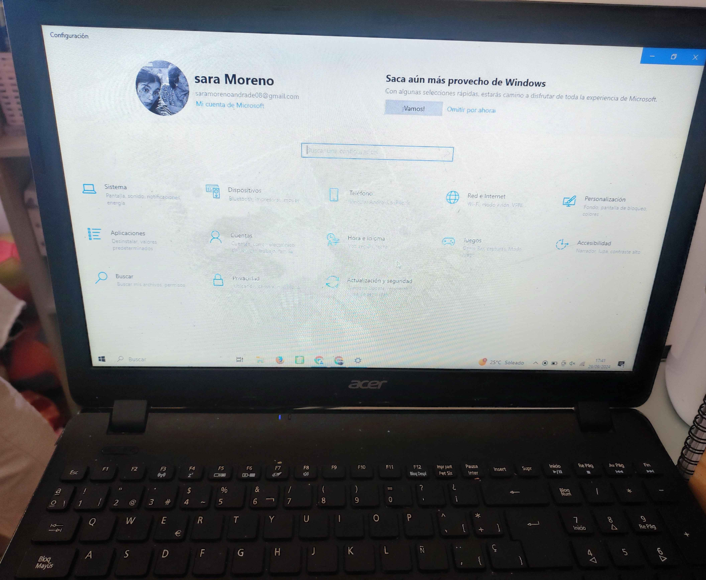

# MI LÍNEA DEL TIEMPO

## 2006-2014
- Anteriormente el contacto con la tecnología habia sido con televisores, ordenadores de clase y los teléfonos de mis padres.
- Primer contacto con la tecnología fué mi regalo de comunión, la [Nintendo Wii Mini RVL-201](https://es.aliexpress.com/item/4001222015403.html?src=google&src=google&albch=shopping&acnt=439-079-4345&isdl=y&slnk=&plac=&mtctp=&albbt=Google_7_shopping&aff_platform=google&aff_short_key=UneMJZVf&gclsrc=aw.ds&&albagn=888888&&ds_e_adid=&ds_e_matchtype=&ds_e_device=c&ds_e_network=x&ds_e_product_group_id=&ds_e_product_id=es4001222015403&ds_e_product_merchant_id=5329354239&ds_e_product_country=ES&ds_e_product_language=es&ds_e_product_channel=online&ds_e_product_store_id=&ds_url_v=2&albcp=21486736708&albag=&isSmbAutoCall=false&needSmbHouyi=false&gad_source=1&gclid=CjwKCAjw9eO3BhBNEiwAoc0-jYBLWQtzv4He7HJqePTEV7zFfLtwSk6INiAUlQmftNY5eAki-cnv9hoCcEwQAvD_BwE) con 3 juegos:
    1. Mario Kart
    2. Just Dance
    3. Mario Bros
## 2015
- Me regalaron mi primera tablet *Lenovo*.
## 2016
- Me regalaron mi segunda tablet *Lenovo*.
## 2017
- Me regalaron mi segunda consola (XBOX360).
****
## 2018
- Me compraron mi primer teléfono (Redmi 8). 
- Me hice mi primera cuenta de gmail.
- Participé en la Feria de la Ciencia.
****
## 2019
- Comencé a aprender programación en **[Scratch](https://scratch.mit.edu/projects/574204874)**.  
- Me compraron mi primer portátil (*acer*).

## 2020
- Me compraron mi segundo teléfono:
>Xiaomi Redmi Note 9
- Aprendi a programar en `App Inventor`.
**** 
- Aprendí programación de la `Placa Crumble`.
- Creación con la placa Crumble de una maqueta de un saltador de vallas. 
## 2021
Año en el que comencé a crear un mayor interés por la infórmatica y ansiaba saber más sobre ella.
- Me compraron mi primer pc.
**** 
- Aprendí a programar `Arduino`.
- Aprendí a programar `Python`.
- Participé en el concurso de la U.C sobre programación en Python y la creación de una aplicación en **App Inventor** sobre los _O.D.S_.
- Realizé una aplicación en **App Inventor** utilizada para informar sobre las _teorias de los átomos_.

- Aprendí a utilizar `machine learning for kids`.
- Colaboré en el desarrollo de una aplicación en **App Inventor** sobre la cultura, fiestas y costumbres de las diferentes regiones de Cantabria.
- Aprendí a utilizar `HTML y CSS`
- Cree una página web a través de google.
## 2023
- Me compraron ***mi teléfono actual (Xiamoi 11 Lite)***.
- Me regalaron mi segundo portátil *HONOR*.

## 2024
- Me regalaron la *Xbox One* .
- Comencé la carrera de Ingeniería Informática
## Actualmente
Gracias a todo este contacto con la tecnología y a mis profesoras de la E.S.O y bachillerato que me animaron a puntarme al concurso de programación y a estudiar informática, he conseguido: decantarme por esta carrera y crear más interés sobre la tecnología.En el futuro espero terminar la carrera y hacer un máster para ser profesora de secundaria o bachiller y animar a la gente que le gusta a seguir adelante con ello como hicieron conmigo.