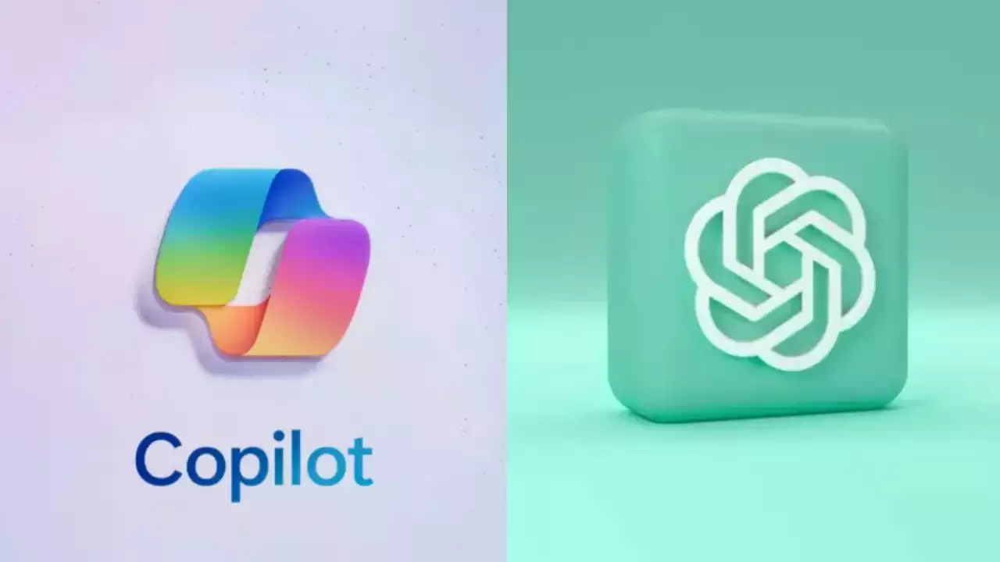

***⏳Línea del tiempo-Mi experiencia con la tecnología🌐***

## 2009 Mi primer contacto con la tecnología📺
- Aunque desde que nací he estado utilizando la tecnología inconscientemente ya que mis padres me ponían los dibujos animados en la televisión,y cuando saliamos a pasear o comer fuera de casa y yo lloraba me daban sus teléfonos móviles con los dibujos puestos. 
Pero este año es cuando empecé a tener mas conciencia de lo que queria ver en la televisión y como funcionaba el mando para cambiar de canal.
## 2010 Mi primera tablet📱
- Mi padre compró una tablet a mi madre que la acabé utilizando yo, para jugar a juegos sencillos,escuchar musica o ver videos, por lo que se convirtió en la priemra tablat que tuve.

## 2011 Mi primera cámara de fotos digital📸
- Como me gustaba hacer fotos con los móviles de mis padres, ellos me regalaron una cámara de fotos.

## 2012 Mi primera consola🕹️
- Mis padres me compraron para mi cumpleaños la wii, desde entonces la use durante bastante tiempo.

## 2015 Mi primera tablet personal
- Mis padres me compraron una tablet para que puedira buscar información y no tuviera que utilizar la de mi madre.
- Empecé a jugar a juegos más complejos
## 2017 mi primer móvil📲
Mis padres me regalaron mi primer móvil para poder comunicarme.

## 2018 Mi primer contacto con las redes sociales🤳 
- Empecé a utilizar _instagram_ aunque lo usaba poco en ese año, mas adelante lo empecé a usar mucho más.
 - Empecé a usar _TikTok_ y desde entoces se utilizarlo
## 2020 Mi primer ordenador🖥️  y mi segundo móvil  
- Mi madre me regaló un ordenador que en su trabajo ya no usaban para que pudiera realizar mis trabajos del instituto y no tuviera que estar con la tablet. Era un **ordenador de escritorio** que usaba `windows 10`,aprendí lo básico aparte de navegar por internet empecé a usar programas como `Microsoft Word` y `Excel`.

---
- Este año me regalaron un móvil nuevo ya que el mio ya no funcionaba bien.
## 2021 Pandemia😷
- Durante el confinamiento utilice bastante la tecnología, ya fuera por ocio o por trabajos que nos mandaban en el instituto.Utilicé aplicaciones como _classroom,teams,yedra_...Y para editar mis trabajos empecé a usar _powerdirector_,comprensores de video...

- Por mi cuenta empecé a editar videos e imagenes y creando proyectos con _powerdirector,capcut,Picsart,Tempo_...para felicitar a amigos o simplemente para hacer un video de alguien al que admiraba.Además de utilizar las redes sociales como _tiktok,instagram,snapchat_...
## 2022 Launchpad y la Play🎮
- Como me gustaba mucho la música me regalarón por navidad un _Novation Launchpad_, es un controlador de música que te permite iniciar clips de audio, efectos y crear shows de luces sin necesidad de usar un mouse.Para utilizarlo uso el programa AbletonLive.
- Jugué por primera vez a _la Play_ en casa de mi primo

## 2023 Copilot y chatGPT🤖
- Empece a utilizar _Copilot y chatGPt_ para realizar trabajos de clase

## 2024 ~~ La primera vez utilizando~~Gafas realidad virtual🌌,mi primer portátil 💻y mi tercer movil, hacia delante➡️
- En casa de un amigo utilicé las gafas de realidad virual aunque no fue la primera vez, pero si la primera vez en usarlas en una casa y descargandome mis propios juegos a los que quería jugar.

 <video width="200" controls>
    <source src="realidad virtual.mp4" type="video/mp4">
    Tu navegador no soporta la etiqueta de video.
</video>

<audio width="200" controls>
    <source src="realidad virtual (online-audio-converter.com).mp3" type="audio/mpeg">
    Tu navegador no soporta la etiqueta de video.
</audio>

---
- Me compré un nuevo móvil ya que el anterior se me rompió
- Mis padres me compraron un portátil ya que escogí hacer la carrera de ingeniería informática.
- Empecé a utilizar _la terminal,github,git,gitbush visual studio code,java_...

# Lista de Tareas

## Tareas pendientes
- [ ] Saber programar
- [ ] Saber utilizar nuevas aplicaciones

## Tareas completadas
- [x] Saber utilizar la terminal
- [x] Saber utilizar github
- [x] Saber utilizar el lenguaje markdown
- [x] Empezar a usar lenguaje HTML

   
***RESUMEN*** 
-
### ⏳Línea del tiempo-Mi experiencia con la tecnología🌐

| Año  | Tecnología o Herramienta    | Descripción                                    |
|------|-----------------------------|------------------------------------------------|
| 2009 | `Televisión` | Mi primer contacto con el mado de la televisión. Aprendí lo básico como cambiar de canal. |
| 2010| `Tablet`              | Mi primer contacto con la tablet de mi madre. Aprendí a decargarme juegos y escuhar música. |
| 2011 | `Cámara de fotos digital` | Me regalaron una camara ya que me gustaba mucho hacer fotos. |
| 2012 | `Consola` | Me regalaron la wii
| 2015 | `Tablet personal`         | Me regalaron una tablet para no tener que usar la de mi madre, y empecé a jugar a juegos más complejos. |
| 2017 | `Móvil`    | Me regalaron mi primer móvil para poder comunicarme. |
| 2018 |`Redes sociales`    |Empecé a utilizar instagram y tiktok .
| 2020 |`Ordenador` y `2º móvil`    | Me regalaron mi primer ordenador y mi segundo móvil.
| 2021 |`PowerDirector`,`comprensores de video`,`CapCut` `Picsart`,`Tempo` | Durante la pandemia utilicé bastante la tecnología.
| 2022 |`Launchpad`,`la play`   | Me regalaron un Novation Launchpad y jugué por primera vez a la play.
| 2023 |`Copilot y chatGPT`    | Empecé a usar estas aplicaciones para poder resolver algunas tareas del instituto.
| 2024 |`Gafas realidad virtual`,`Potátil`,`3º móvil`,`la terminal`,`github`,`git`,`gitbush`,`visual studio code`,`java`    |Utilicé las gafas de realidad virtual , me regalaron un portátil por la carrera que voy a estudiar y me regalaron un móvil nuevo. De aqui hacia delante empezaré a usar aplicaciones nuevas.

  [Este video me ayudó a poder entender mejor el lenguaje Markdown](https://youtu.be/y6XdzBNC0_0?si=sy60wOptRB6WiXG6)